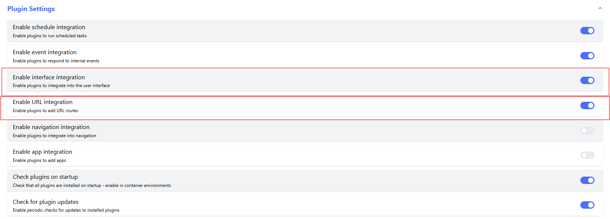
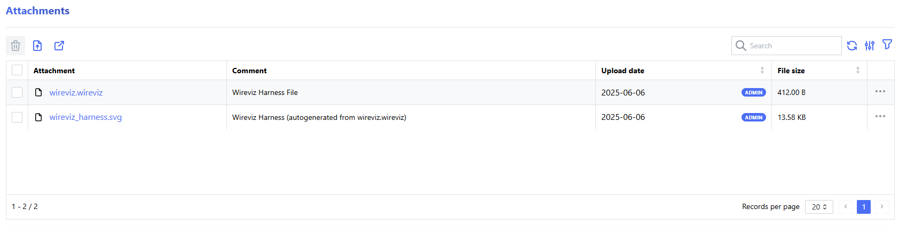

[](https://opensource.org/licenses/MIT)
[](https://pypi.org/project/inventree-wireviz-plugin/)


# inventree-wireviz

The **inventree-wireviz** plugin provides direct integration for [wireviz](https://github.com/formatc1702/WireViz), a text-based wiring harness specification tool.

## Functionality

The plugin provides a number of key functions:

### Harness Diagram Generation

This plugin provides server-side generation of a wiring harness diagram from a `.wireviz` file. Uploading a simple [harness file](./demo/harness.wireviz) results in the generation of a wiring diagram:


> **Note**
> Refer to the [wireviz syntax guide](https://github.com/formatc1702/WireViz/blob/master/docs/syntax.md) for a full description of the file format.

The generated harness diagram is available as a `.svg` file.

### BOM Extraction

Bill of Materials (BOM) information can be extracted directly from the harness description file, allowing for a harness assembly to be fully qualified from the template file.

### Report Generation

The generated `.svg` can be used in report templates, for example as a reference diagram in a Build Order Report

## Installation

### Installation Requirements

You must have [graphviz](https://graphviz.org/) installed, and accessible by the InvenTree server.

e.g. `apt-get install graphviz`

If installing in a container environment (e.g. Docker), the dockerfile will need to be extended to install the *graphviz* binaries

### Plugin Installation

The plugin is available [via PIP](https://pypi.org/project/inventree-wireviz-plugin/). Follow the [InvenTree plugin installation guide](https://docs.inventree.org/en/latest/extend/plugins/install/) to install the plugin on your system

### Configuration

Once the plugin is installed, it needs to be enabled before it is available for use. Again, refer to the InvenTree docs for instructions on how to enable the plugin. After the plugin is enabled, the following configuration options are available:


| Setting | Description |
| --- | --- |
| Wireviz Upload Path | Directory where wireviz *template* files can be uploaded, and referenced by wireviz. This is an *advanced* option. Refer to the wireviz docs for more information on templates. |
| Delete Old Files | Remove old harness diagram files when a new `.wireviz` file is uploaded |
| Extract BOM Data | Extract BOM data from harness file and generate new BOM entries |
| Clear BOM Data | Remove existing BOM entries first, before creating new ones |
| Add Part Image | Where available, embed part images in the generated harness diagram |

Additionally, you must ensure that the *Enable event integration* setting is enabled in the *Plugin Settings* view:



## Operation

### Uploading Wireviz File

To generate a wiring harness diagram for a specific Part, upload a (valid) wireviz yaml file. The file **must* have the `.wireviz` extension to be recognized by the plugin.

When the file is uploaded to the server, the plugin is notified and begins the process of generating the harness diagram. If successful, a `.svg` file is attached to the part instance:



### Harness Diagram Panel

When a Part has a valid harness diagram (i.e. generated without any critical errors), the *Harness Diagram* panel will be available for that part. This panel displays the diagram image, and a simple Bill of Materials (as defined in the uploaded `.wireviz` file):


> **Note**
> You may need to reload the page before this panel is visible

> **Warning**
> Any warnings or errors which were raised during the process will be displayed here

### BOM Extraction

If enabled, the plugin will attempt to generate a linked Bill of Materials based on the data provided in the file. Part linking is performed based on the `pn` (part number) attribute in the wireviz BOM.

For each line item in the uploaded BOM, the plugin attempts to match the `pn` field to an existing part in the InvenTree database. If a matching part is not found, this is marked with a warning in the simplified BOM table in the [harness diagram panel](#harness-diagram-panel).

### Reports

The generated diagram can be used in certain reports (such as the Build Order Report). If a wiring harness diagram is available for a Part, it is included in the report context as a variable named `wireviz_svg_file`.

> **Note**
> The provided variable refers to the *filename* of the `.svg` image - not the file itself.
> Use the `` template tag to render the image file.

A very simple example is shown below:

```html





{{ block.super }}

.harness {
    border: 1px solid #AAA; 
    width: 100%;
    display: inline-block;
}





{{ block.super }}



    <h4>Harness Drawing</h4>
    



```

The resulting report is rendered as below:


## Wireviz Documentation

Documentation on the capabilities of wireviz itself:

- https://github.com/formatc1702/WireViz/blob/master/docs/README.md
- https://github.com/formatc1702/WireViz/blob/master/docs/syntax.md
